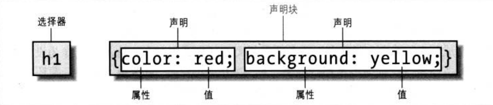

# 《CSS 权威指南 （第三版）》

## 第一章

### XHTMM 的层次结构要求

行内元素可以继承块元素，但反之不允许。

### HTML 与 CSS 关联的几种方式

- Link 标记的使用（外部样式表）
- style 元素
- @import 指令：必须放在所有 CSS 规则之前。同时可以在一个 CSS 文件中靠@import 导入另一个 CSS 文件（CSS 文件中不允许有标签）。
- 内联样式：为单一元素指定样式

## 第二章 选择器

### 结构



1.  元素选择器

最基本的选择器。

2.  分组选择器

3.  类选择器

4.  ID 选择器

5.  多类选择器

可以同时选中多个类。

6.  属性选择器

根据属性名：

```css
h1[class] {
  color: sliver;
}
```

根据具体的属性值：

```css
h1[class="aa"] {
  color: sliver;
}
```

_根据部分属性值选择：_
假设 class="urgent warning"，而需要选中 class 中包含 warning 的元素，可以这么写：

```css
p[class~="warning"] {
  font-weight: bold;
}
```

更多的子串匹配属性选择器：

| 类型         | 描述                                 |
| ------------ | ------------------------------------ |
| [foo^="bar"] | 选择 foo 属性以"bar"开头的所有元素   |
| [foo&="bar"] | 选择 foo 属性以"bar"结尾的所有元素   |
| [foo*="bar"] | 选择 foo 属性包含子串"bar"的所有元素 |

### 理解父子文档关系

文档中的每个元素要么是另一个元素的父元素，要么是另一个元素的子元素，而且通常都有。

### 后代选择器

两个元素之间的间隔可以是无限的。

### 选择子元素

有时候我们希望缩小范围，只选择一个元素的子元素而不是其所有的后代元素。

### 选择相邻兄弟元素

要选择紧接在另一个元素后的元素，且两者拥有相同的父元素，可以使用相邻兄弟元素选择器。（符号为 + )

```css
htnl > body table + ul{
  margin-top: 1.5em;
}
```

### 伪类和伪元素

可以为文档中不一定具体存在的结构指定样式。

对于超链接a，有常用的四个伪类

```css

	* a:link {color: #FF0000}         /* 未访问的链接 */
	* a:visited {color: #00FF00}      /* 已访问的链接 */
	* a:hover {color: #FF00FF}       /* 鼠标移动到链接上 */
	* a:active {color: #0000FF}      /* 选定的链接 */
```

同时要注意伪类的顺序，这点很重要。

### 选择第一个子元素

可以使用 `first-child` 来选择元素的第一个子元素。

**注意这个选择器选择的是当前这个元素的第一个元素，而不是当前元素的子元素！**

### 伪元素选择器

1. :first-letter 选择元素首字母
2. :first-line 选择元素第一行
3. :before、:after 之前和之后插入内容

## 第三章 结构和层叠

继承是从一个元素向其起后代元素传递属性值所采取的机制。确定应该向那个元素应用功能哪些值时不仅要考虑继承，还要考虑声明的特殊性。

### 特殊性 （权重值）

* ID 值为 100
* 类属性、属性选择为 10
* 各个元素和伪元素为 1
* *没有任何贡献
* 内联样式为 1000

### 继承
